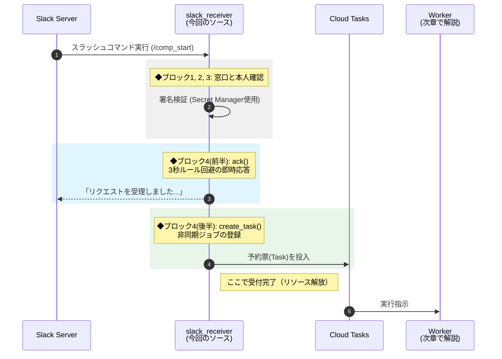
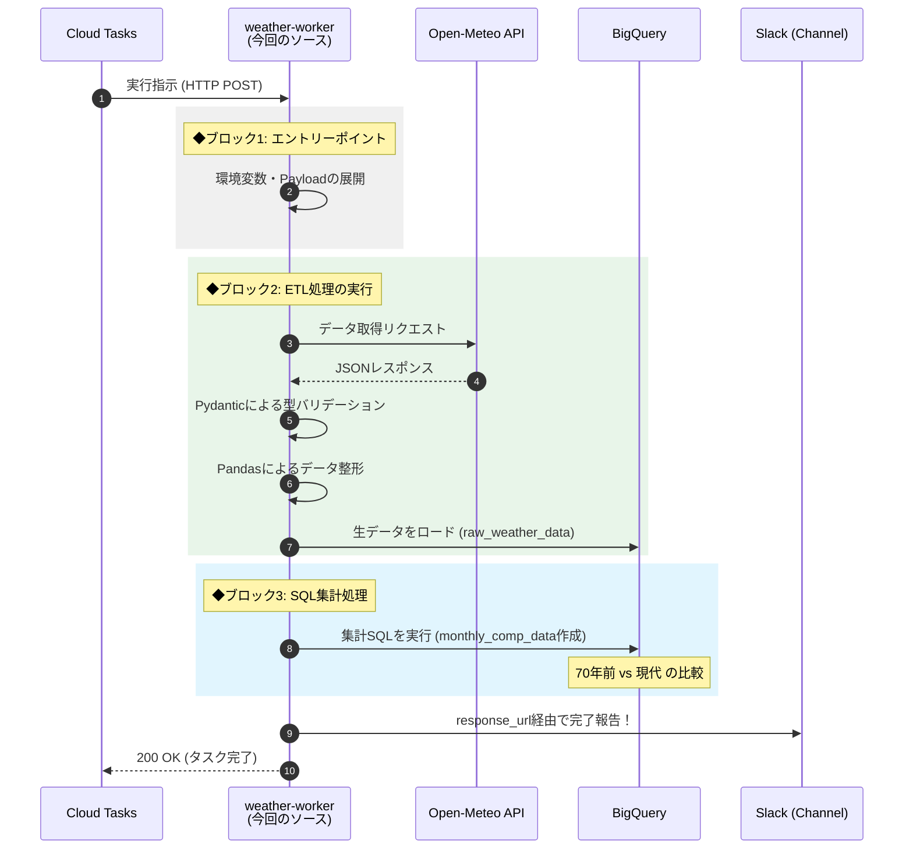

# 1.はじめに
Google Cloud の学習成果を実践形式でアウトプットするため、日常的な疑問（近年の酷暑）をテーマに、「1950年代と現代の気象統計における有意差の検証」を行いました。
題材の選定では、データパイプラインの設計からインフラのコード化（IaC）、非同期処理の実装まで、データエンジニアリングに必要な技術要素を一通り経験できるよう設計しました。
本プロジェクトは、20年間のデジタル回路設計のキャリアで培った経験をベースにして、データエンジニアへの転身を見据えた中で、初めて構築したポートフォリオとなります。

以下に、70年前との最高気温比較の結果を`Looker Studio`で可視化した内容を掲載します。


| ◆構成 |
|:---------------|
|[1.はじめに](#1はじめに) |
|[2.技術スタックとシステム構成](#2技術スタックとシステム構成)|
|[3.「Cloud Functions」のソース詳細](#3cloud-functionsのソース詳細)|
|[4.Terraformによるインフラ定義](#4terraformによるインフラ定義)|
|[5.デプロイ方法](#5デプロイ方法)|
|[6.Slack API への設定](#6slack-api-への設定)|
|[7.Slack App からの動作確認](#7slack-app-からの動作確認)|
|[8.データ可視化/考察](#8データ可視化考察)|
|[9.まとめ](#9まとめ)|


# 2.技術スタックとシステム構成

## 2-1.技術スタック

本システムでは、以下の技術スタックを採用しています。

### 2-1-1. プラットフォーム (Google Cloud)
データの処理・保存・管理を行うバックエンドの仕組みとして、以下のサービスを使用しています。

| サービス| 説明 |
| :--- | :--- |
|Cloud Functions|サーバーレス実行環境|
|Cloud Tasks| バックグラウンド処理のスケジューラー |
|BigQuery| サーバーレスなデータ倉庫|
|Secret Manager|機密情報管理サービス |
|IAM|ユーザーやサービスの権限管理|
|Cloud Build|ビルド・デプロイの自動化プラットフォーム|
|Artifact Registry|コンテナイメージやアーティファクトの管理・格納|
|Cloud Storage|データの保管・管理を行うオブジェクトストレージ|

### 2-1-2. 分析・可視化ツール
蓄積されたデータをユーザーが見るための画面（フロントエンド）の仕組みです。

| ツール | 説明 |
| :--- | :--- |
|Looker Studio|データの可視化・レポート作成ツール|


### 2-1-3. インフラ管理ツール
| ツール | 説明 |
| :--- | :--- |
|Terraform|Google Cloud上のリソース/権限設定を、コードで一元管理|


### 2-1-4. 言語・ライブラリ (Python)

| ライブラリ|説明 |
| :--- | :--- |
|Python|3.11|
|Slack Bolt|Slack アプリ開発用の公式フレームワーク|
|Pandas|取得データの整形、加工、および BigQuery へのロードを行うためのデータ分析ライブラリ|
|Google Cloud BigQuery|BigQuery へのデータの読み書き、クエリ実行を行うための GCP 公式ライブラリ|
|Functions Framework|Cloud Functions 上で HTTP リクエストを受け取って関数を実行するための基盤|
|Google Cloud Tasks|非同期処理のキューを作成し、関数の実行を制御するためのクライアントライブラリ|
|Requests|外部のAPI へ HTTP リクエストを送信し、データを取得するライブラリ|
|PyArrow|Pandas のデータを BigQuery に効率よく高速に転送するために内部で使用されるライブラリ|
|pydantic|データが正しい形式かチェック（バリデーション）し、自動で型変換を行うライブラリ。|
|typing|「この変数はリストなのか数値なのか」といった型情報を明示するための標準モジュール。|

### 2-1-5. 外部サービス (API)

|API/サービス|説明 |
| :--- | :--- |
| Open-Meteo API|歴史的気象データの取得に使用|
|Slack API|通知およびユーザーインターフェースに使用|

## 2-2. ディレクトリ構成
インフラ管理（Terraform）コマンドで、デプロイできる以下の構成となっています。
このデータセットは、GitHubレポジトリ登録しています。
https://github.com/wata123-t/weather-shift-analyzer

```text
.
├── .gitignore
├── README.md               # 使い方・セットアップ手順
├── functions/              # Pythonコード
│   ├── receiver/
│   │  ├── main.py
│   │  └── requirements.txt # 依存ライブラリ
│   └── worker/
│       ├── main.py
│       ├── requirements.txt # 依存ライブラリ
│       └── sql/             # 集計用SQLクエリ
│           └── create_monthly_comp.sql
│
└── terraform/
    ├── main.tf                  # リソース定義
    ├── variables.tf             # 変数定義（sensitive設定含む）
    ├── terraform.tfvars.example # 見本ファイル
    └── files/                   # デプロイ用ZIPを一時保存する場所

```

## 2-3. システム構成
システム構成と簡易フローを図示します。（詳細は後述のセクションを参照）


### 1.処理フロー

-----

クライアントアプリから「スラッシュコマンド」実行後のフロー概要を記載します。
`Slack App`での動作は、[こちら](#7slack-app-からの動作確認)を参照して下さい。

**①Secret取得:** `Secret Manager`からAPIトークンを取得し、リクエストの署名検証を実施
**②即時応答(ack):** Slackの「3秒ルール」回避の為、`Slack Server`へレスポンスを返す
**③タスク登録:** 重いデータ処理を非同期で行うため、`Cloud Tasks`のキューへ実行指示を登録
**④実行リクエスト:** `Cloud Tasks`が、認証情報を付与して`weather_worker`を起動
**⑤APIリクエスト:** 外部`Open-Meteo API`へ、指定した期間（70年前と現代）のデータを要求
**⑥データ取得:** JSON形式の気象データを取得し、Pythonでバリデーションと整形を実施
**⑦データ格納:** 整形データを`BigQuery`の生データ用テーブル（`weather_table`）へロード
**⑧集計処理:** SQL実行でデータ形式を変換して比較用テーブル(`monthly_comp_data`)を生成
**⑨完了通知:** 処理の完了メッセージを、Slackの`response_url`を通じてユーザーへ通知
**⑩HTTPレスポンス:** `HTTP 200 OK`を返して、`Cloud Tasks`にタスクの完了を通知
**⑪可視化:** 集計データを`Looker Studio`で接続し、ダッシュボードとしてグラフ表示

-----

### 2. IAM(Identity & Access Management)
-----
IAMは、Google Cloud上の各リソースに対する「誰が（Identity）」「どのリソースに（Resource）」「どのような操作（Role）」ができるかを定義します。本構成では、**最小権限の原則** に基づき、各コンポーネントに必要な権限のみを付与しています。

>#### 1.サービスアカウントによる認証と認可
`slack_receiver`,`weather_worker`には、共通の **専用のサービスアカウント(function_sa)** を紐付けています。
これにより、個人のユーザーアカウントを使用することなく、システム間で安全な認証・認可を行っています。


>#### 2. 付与されている主な役割（Role）
図内の **IAM** セクションで示されている権限の役割は以下の通りです。

**・bq_editor/bq_job_user:** 気象データを`weather_table`に書き込み、クエリジョブを実行するために使用します。
**・cloud_tasks_enqueuer:** `Cloud Tasks`にジョブを入れるための権限です。
**・Secret Manager Accessor:** `slack Secret`を参照するために、`slack_receiver`に付与されています。

# 3.「Cloud Functions」のソース詳細
ここでは2つの関数の役割を解説します
## 3-1.「slack_receiver」(./function/receiver/main.py)
本関数は、システム全体の **「受付窓口（フロントデスク）」** です。
Slackの「3秒ルール（レスポンス遅延エラー）」を回避しつつ、重い処理を後続の関数に繋ぐ役割に特化させています。

### 1.処理フローとソースの対応図
この関数の処理フローを図示します。
図中の`◆ブロック1,2,3,4`は、コード内のコメントと一致しています。



<details>
<summary>コード(slack_receiver)</summary>

```python
import os
import json
from slack_bolt import App
from slack_bolt.adapter.google_cloud_functions import SlackRequestHandler
from google.cloud import tasks_v2

# インスタンスをグローバルに定義し、コールドスタートを高速化
client = tasks_v2.CloudTasksClient()

#################################
# ◆ブロック1:「Bolt アプリの初期化」
#################################
# 1. Secret Manager から値を取得、環境変数にセット済(Terraform)
# 2. 環境変数から値を読み取り、署名検証(Signing Secret)の準備を行う
app = App(
    token=os.environ.get("SLACK_BOT_TOKEN"),
    signing_secret=os.environ.get("SLACK_SIGNING_SECRET"),
    # Cloud Functions で ack() を先に返すための設定
    process_before_response=True
)

####################################################
# ◆ブロック2:「Cloud Functions 用のハンドラー作成」
####################################################
handler = SlackRequestHandler(app)

###################################
# ◆ブロック3:「エントリーポイント」
###################################
def slack_receiver(request):
    # Bolt にリクエストを丸投げ（ここで署名検証とコマンド実行が行われる）
    return handler.handle(request)


# 環境変数読み込み
PROJECT  = os.environ.get("PROJECT_ID")
LOCATION = os.environ.get("LOCATION")
QUEUE = os.environ.get("QUEUE_ID")
WORKER_URL = os.environ.get("WORKER_URL")
SA_EMAIL = os.environ.get("SERVICE_ACCOUNT_EMAIL") 

############################################################
# ◆ブロック4:「スラッシュコマンド(/comp_start)のハンドラー」
############################################################
@app.command("/comp_start")
def handle_weather(ack, body):
    # 1. Slackへ即座に応答を返す（3秒ルール回避）
    ack("リクエストを受理しました。気象データの集計を開始します...")
    
    # 2. 後続の関数に必要な情報を取得
    response_url = body.get("response_url")
    command_text = body.get("text", "")

    parent = client.queue_path(PROJECT, LOCATION, QUEUE)

    # 3. 非同期タスクの生成
    task = {
        'http_request': {
            'http_method': tasks_v2.HttpMethod.POST,
            'url': WORKER_URL,
            'headers': {"Content-type": "application/json"},
            'body': json.dumps({
                "text": command_text,
                "response_url": response_url
            }).encode(),
            'oidc_token': {
                'service_account_email': SA_EMAIL
            }
        }
    }

    # 4. キューの投入（バトンタッチ完了）
    try:
        client.create_task(parent=parent, task=task)
    except Exception as e:
        print(f"Error creating task: {e}")
```
</details>

----

### 2.実装のポイント
----
>#### ① 署名検証と初期化 (◆ブロック1〜3)
Slackからのリクエストが正規のものか、`Secret Manager`から取得した`SLACK_SIGNING_SECRET`を用いて検証します。
**・処理の委譲:** `SlackRequestHandler(app)`に処理を委譲することで、複雑な署名検証ロジックを自前で書かずに安全性を担保しています。

>#### ② 3秒ルールの突破 (◆ブロック4 前半)
Slack APIには「リクエスト後、3秒以内に応答がないとエラー出力」という制約があります。
**・即時応答**: 実務(集計)を始める前に、まず `ack()` で「受理しました」という応答を返す。

:::note info
**なぜ `ack()` の後も処理が続くのか？**
本来レスポンスを返すと関数は終了しますが、`process_before_response=True` 設定により「返信を優先しつつ、その後のタスク投入まで完遂させる」挙動を実現しています。
:::


>#### ③ 非同期タスクの生成 (◆ブロック4 後半)
時間のかかる気象データの集計は、自分では行いません。
**・予約票の作成**: ユーザー入力（text）と結果報告用の宛先（`response_url`）をJSONに固め、**Cloud Tasks** へ投入します。
**・認証**: タスク作成時に `oidc_token` を付与。これにより、後続のWorker関数を「許可されたシステムからのリクエスト」として安全に呼び出せます。

------------------------------------------------------------------------------------------

## 3-2.「weather-worker」(./function/worker/main.py)
本関数は、Cloud Tasksからバトン（予約票）を受け取り、実際に重い処理を完遂する **「実務実行部隊」** です。Open-Meteo APIからのデータ取得から、BigQueryでの統計解析までを一気通貫で行います。


### 1.処理フローとソースの対応図
この関数の処理フローを図示します。
図中の`◆ブロック1,2,3`は、コード内のコメントと一致しています。




<details>
<summary>コード(weather-worker)</summary>

```python
import functions_framework
import pandas as pd
import requests
import os
from google.cloud import bigquery
from pydantic import BaseModel, Field
from typing import List, Optional

##############################
# Pydantic モデルの定義
##############################
# APIのレスポンス構造を定義
class DailyData(BaseModel):
    time: List[str]
    temperature_2m_max: List[Optional[float]]
    temperature_2m_min: List[Optional[float]]
    relative_humidity_2m_mean: List[Optional[float]]

# ルートの構造
class WeatherResponse(BaseModel):
    daily: DailyData

PROJECT_ID = os.environ.get("PROJECT_ID")
DATASET_ID = os.environ.get("DATASET_ID")
TABLE_ID   = os.environ.get("TABLE_ID")
# 環境変数は「文字列」で届くため、数値計算やAPI用に float へキャスト
LAT        = float(os.environ.get("LAT")) 
LON        = float(os.environ.get("LON"))
 

#######################
# ◆ブロック1:「エントリーポイント」
#######################
@functions_framework.http
def fetch_weather_handler(request):
    # 1. リクエストと環境変数の取得
    request_json = request.get_json(silent=True)
    response_url = request_json.get('response_url') if request_json else None
    
    table_path = f"{PROJECT_ID}.{DATASET_ID}.{TABLE_ID}"
    client = bigquery.Client(project=PROJECT_ID)
    
    # デフォルトの成功メッセージ
    message = "✅ 気象データの更新と集計テーブルの作成が完了しました！"

    try:
        # 2. 既存データの消去
        client.query(f"TRUNCATE TABLE `{table_path}`").result()

        #########################################
        # ◆ブロック2:「ETL処理の実行」
        #########################################
        # サブ関数へ座標(LAT, LON)を引数として渡し、データをロード
        fetch_and_load("1952-01-01", "1954-12-31", client, table_path, LAT, LON)
        fetch_and_load("2023-01-01", "2025-12-31", client, table_path, LAT, LON)
        
        #########################################
        # ◆ブロック3: SQL集計処理
        #########################################
        sql_path = os.path.join(os.path.dirname(__file__), 'sql', 'create_monthly_comp.sql')
        with open(sql_path, 'r', encoding='utf-8') as f:
            sql_template = f.read()
        
        # テンプレート内の変数を置換して実行
        sql = sql_template.format(PROJECT_ID=PROJECT_ID, DATASET_ID=DATASET_ID)
        client.query(sql).result() 
        
    except Exception as e:
        # エラー発生時はメッセージを上書きし、ログに出力
        error_detail = str(e)
        if "validation error" in error_detail.lower():
            message = f"❌ APIデータの形式が正しくありません(Pydanticエラー): {error_detail[:100]}..."
        else:
            message = f"❌ 処理中にエラーが発生しました: {error_detail}"
        
        print(f"Detailed Error: {error_detail}")

    # 3. Slack への応答メッセージ送信（response_url がある場合のみ）
    if response_url:
        requests.post(response_url, json={
            "text": message,
            "response_type": "in_channel"
        })

    # Cloud Tasks への正常応答
    return "OK", 200 


####################################
# ◆ブロック2:「ETL処理の実装」
####################################
def fetch_and_load(start, end, bq_client, table_path, lat, lon):
    """
    API抽出(Extract) -> 整形(Transform) -> ロード(Load) を担う汎用関数
    """
    url = "https://archive-api.open-meteo.com/v1/archive"
    params = {
        "latitude": lat, 
        "longitude": lon, 
        "start_date": start, 
        "end_date": end,
        "daily": ["temperature_2m_max", "temperature_2m_min", "relative_humidity_2m_mean"],
        "timezone": "Asia/Tokyo"
    }
    
    # APIリクエスト
    response = requests.get(url, params=params)
    response.raise_for_status() 
    
    # Pydantic を使用:生データをモデルに流し込み、チェックと変換を行う
    weather_data = WeatherResponse(**response.json())
    # 合格したデータを辞書に戻す(model_dump() で辞書化し、その中の ['daily'] 部分だけを取り出す)
    valid_daily_dict = weather_data.daily.model_dump()
    # Pandasによるデータ整形
    df = pd.DataFrame(valid_daily_dict)
    # DATE型へ変換（時刻の切り捨て）
    df['time'] = pd.to_datetime(df['time']).dt.date
    
    # カラム名を BigQuery のスキーマに合わせる
    df = df.rename(columns={
        "time": "date", 
        "temperature_2m_max": "temp_max",
        "temperature_2m_min": "temp_min", 
        "relative_humidity_2m_mean": "humidity_mean"
    })
    
    # BigQuery への追記ロード
    job_config = bigquery.LoadJobConfig(write_disposition="WRITE_APPEND")
    job = bq_client.load_table_from_dataframe(df, table_path, job_config=job_config)
    job.result()


```
</details>

----

### 2.実装のポイント
----

>#### ① Pydantic による型安全なデータ受け入れ
外部API（Open-Meteo）から届くデータが期待通りか、Pydanticモデルで厳格にチェックします。
**・メリット:** API側の仕様変更や欠損による「型不一致」などを最上流でブロック。**不正なデータが後続の処理やBigQueryへ混入することを未然に防ぎ、システムの堅牢性を高めます。**

>#### ② Pandas を活用した「データの整列」（ETL）
APIのリスト形式データを`Pandas`の`DataFrame`に変換し、`BigQuery`が受け入れやすい「きれいな表形式」へ一括整形します。


**・役割:** 日付型への変換やカラム名の置換を行い、BigQueryのテーブル定義（スキーマ）と一致させています。
**・高速ロード:** `load_table_from_dataframe` を使うことで、数千行のデータも **ストリーミングではなく一括（Batch）で転送するため、書き込みコストを抑えつつ一瞬でロードを完了** させます。


>#### ③ SQL を主役にした「データの集計」（ELT）

複雑な計算や集計は Python 側で行わず、BigQuery の計算リソースをフル活用する **ELT(ELT-Extract/Load/Transfer）パターン** を採用しました。（詳細は後述のSQLセクションを参照）

**SQLの優位性:** 「月次データへの変換」「70年前と現代の比較」「不快指数の算出」といった重い計算は、分散処理が得意なBigQueryに任せるのが最も効率的です。

>#### ④ Slack への通知
処理の最終結果を、スラッシュコマンドの応答用URL（`response_url`）へ報告します。

:::note info
**response_url の利点**
Slackから受信した`response_url`は発行から **最大30分間** 有効であり、このURLを使うことで、面倒なOAuth認証（Botトークン管理）を使用しない通知が出来ます。
:::

>#### ⑤ Cloud Taskへの通知
`weather-worker`が `HTTP 200 OK` を返すことで、Cloud Tasks 側にタスクの完了を伝えます。


## 3-3.統計解析用SQL
SQLでは、70年前と現代のデータを「月別」で横並びにし、**「体感的な暑さ」** を示す **不快指数の計算** まで行います。
このSQL は、「./functions/worker/sql/create_monthly_comp.sql」を使用しています。


### 1.変換内容
このSQLが担当しているのは、膨大な「日次の生データ」を、人間が理解しやすい「月次の比較レポート」へ変換させる工程です。

>#### 変換前：日次データ
Open-Meteo APIから取得した直後のデータは、1日1行の **「縦に長い」** 形式です。
この状態では、70年前との比較を一目で把握するのは困難です。
対象期間: 1952年〜1954年（3年間） ＋ 2023年〜2025年（3年間）
データ量: 約2,190行（365日 × 6年分）

|date|temp_max|temp_min|humidity_mean|
| :--- | :--- | :--- | :--- |
|1952-01-01|4.4|-2.8|47.0|
|.......|...|...|..|
|1954-12-31|3.8|-2.3|44.5|
|2023-01-01|8.9|1.8|43.0|
|.......|...|...|..|
|2025-12-31|6.7|0.8|42.5|


>#### 変換後：月次比較データ

SQLを実行することで、データは **「12行（1月〜12月）」** に集約され、さらに「過去」と「現代」が **「横に並んだ」** 形式に変わります

**「70s最高」、「現最高」** は、その月の「日最高気温の平均値」を指します。
| 月 | 70s平均 | 70s最高 | 70s湿度 | 70s DI | 現平均 | 現最高 | 現湿度 | 現 DI |
| :--- | :---: | :---: | :---: | :---: | :---: | :---: | :---: | :---: |
| 1 | 3.0 | 7.3 | 72.1 | 40.5 | 5.3 | 9.9 | 61.7 | 45.0 |
| 2 | 2.1 | 6.8 | 75.2 | 38.9 | 6.4 | 11.0 | 58.2 | 46.9 |
|.|...|...|...|...|...|...|..|
|11|10.8|14.4|76.0|52.4|12.8|17.0|71.8|55.6|
|12|6.3|10.1|74.4|45.5|7.7|12.4|63.4|48.5|


>#### 変換による優位性
このSQLによる加工を行うことで、Looker Studioでの可視化が圧倒的にスムーズになります。

**比較の容易性:** 過去と現代を1行に並べることで、月ごとの気温差がひと目でわかります。
**体感の数値化:** 生データにない「不快指数(DI)」を算出し体感的な暑さを可視化します。
**一目でわかる：** 膨大な記録を12行の月別サマリーに凝縮する事で、「過去」、「現代」の差が一目瞭然となります。


### 2.変換方法

このSQLは、大きく分けて「①出力先定義」「②日次計算（下準備）」「③月次集計（仕上げ）」の3セクションで構成されています。それぞれの役割を説明します。

>#### ① 出力先と更新ルールの定義

```sql
CREATE OR REPLACE TABLE `{PROJECT_ID}.{DATASET_ID}.monthly_comp_data` AS
```
**役割:** 解析結果を格納する専用テーブルを作成します。
**ポイント:** OR REPLACE を使うことで、関数が実行されるたびに最新の集計結果でテーブルを上書き更新します。

>#### ② 日次データの加工（WITH daily_data 句）
```sql
WITH daily_data AS (
  SELECT
    EXTRACT(MONTH FROM date) AS month,
    EXTRACT(YEAR FROM date) AS year,
    (temp_max + temp_min) / 2 AS avg_temp,
    -- ★ 不快指数 (DI) の1日単位算出
    (0.81 * ((temp_max + temp_min) / 2) + 0.01 * humidity_mean * (0.99 * ((temp_max + temp_min) / 2) - 14.3) + 46.3) AS di
  FROM `{PROJECT_ID}.{DATASET_ID}.raw_weather_data`
)
```
**役割:** 生データから「月」「年」「平均気温」を抽出し、 **「不快指数（DI）」** も算出します。
**ポイント:** DI値の算出を **「1日ごとのデータ」から計算し平均化する事** で、より実態に近い数値を導き出しています。

>#### ③ 月次集計と「過去vs現代」の展開（メインSELECT句）
```sql
SELECT
  month,
  -- 70年前 (1952-1954) の集計列
  ROUND(AVG(IF(year BETWEEN 1952 AND 1954, avg_temp, NULL)), 1) AS avg_temp_70s,
  -- 現代 (2023-2025) の集計列
  ROUND(AVG(IF(year BETWEEN 2023 AND 2025, avg_temp, NULL)), 1) AS avg_temp_now
FROM daily_data
GROUP BY month
ORDER BY month;

```
**役割:** 「過去」、「現代」のデータを、月ごとに横並びにします。
**ポイント:** `ROUND(..., 1)`で小数第一位に揃えて、数値をスッキリと見やすくしています。

**●処理内容:** 

**・処理1（グループ化）:**
`GROUP BY month`によって、膨大なデータを、1月、2月…という 12個の箱 に振り分けます。
**・処理2（条件付き抽出）:**
`SELECT`句内の IF 文が、各月の箱の中で「過去用」、「現代用」のデータを仕分けし、対象外データは NULL に設定します。
**・処理3（集計・合体）:**
`AVG`が、仕分けられたデータから`NULL`を除外して月のごとの平均値を算出します。これにより、「過去」と「現代」の数値が1行に揃って出てくるのです。


<details>
<summary>コード(create_monthly_comp.sql)</summary>

```sql
CREATE OR REPLACE TABLE `{PROJECT_ID}.{DATASET_ID}.monthly_comp_data` AS
WITH daily_data AS (
  SELECT
    EXTRACT(MONTH FROM date) AS month,
    EXTRACT(YEAR FROM date) AS year,
    temp_max,
    temp_min,
    (temp_max + temp_min) / 2 AS avg_temp,
    humidity_mean,
    -- 不快指数の計算（1日単位）
    (0.81 * ((temp_max + temp_min) / 2) + 0.01 * humidity_mean * (0.99 * ((temp_max + temp_min) / 2) - 14.3) + 46.3) AS di
  FROM `{PROJECT_ID}.{DATASET_ID}.raw_weather_data`
)
SELECT
  month,
  -- 70年前 (1952-1954) の集計
  ROUND(AVG(IF(year BETWEEN 1952 AND 1954, avg_temp, NULL)), 1) AS avg_temp_70s,
  ROUND(AVG(IF(year BETWEEN 1952 AND 1954, temp_max, NULL)), 1) AS temp_max_70s,
  ROUND(AVG(IF(year BETWEEN 1952 AND 1954, humidity_mean, NULL)), 1) AS humidity_70s,
  ROUND(AVG(IF(year BETWEEN 1952 AND 1954, di, NULL)), 1) AS di_70s,
  
  -- 現代 (2023-2025) の集計
  ROUND(AVG(IF(year BETWEEN 2023 AND 2025, avg_temp, NULL)), 1) AS avg_temp_now,
  ROUND(AVG(IF(year BETWEEN 2023 AND 2025, temp_max, NULL)), 1) AS temp_max_now,
  ROUND(AVG(IF(year BETWEEN 2023 AND 2025, humidity_mean, NULL)), 1) AS humidity_now,
  ROUND(AVG(IF(year BETWEEN 2023 AND 2025, di, NULL)), 1) AS di_now
FROM daily_data
GROUP BY month
ORDER BY month;
```

</details>


----
# 4.Terraformによるインフラ定義
初めての Terraform 使用ということもあり、AIを参考にしながらの作成となりました。

## 4-1. Terraform とは
Terraformは、HCL（HashiCorp Configuration Language）という言語を用いてインフラを構築・管理するツールです。
GCPだけでなくAWSやAzureなどの主要クラウドにも対応しています。
最大の特徴は、人間が「作る順番」を細かく指示しなくても、Terraformが リソース間の依存関係を自動で解析し、最適な順序で構築・更新してくれる点 にあります。
また、「State」と呼ばれる管理ファイルでインフラの現状を記憶しているため、コードを変更して再実行するだけで、あるべき姿との差分だけを自動で適用してくれる仕組みです。


## 4-2. 使用方法
専用のバイナリツールをインストールして使用します。provider 宣言で指定したプラットフォーム（今回は Google Cloud）の API を Terraform が裏側で呼び出し、リソースを操作してくれます。
主に以下の 3 種類のブロックを組み合わせてインフラを定義します。

**resource (リソース):** GCP 上に「実物（関数、テーブル、バケットなど）」を作成・管理するためのメインブロック。
**variable (入力変数):** プロジェクトIDなどを外部から注入するための設定。プログラムの「引数」のような役割です。
**data (データソース):** 既存のリソース情報やローカルファイルの内容を参照（読み込み）するためのブロック。

```hcl
resource "種類" "名前" {
  設定項目 = 値
}
```


## 4-3. Terraformコードの解説

### 1. <ins>_プロジェクト初期設定_</ins>

<details>
<summary>Terraformコード(1)</summary>

```terraform
# ---------------------------------------------
# Google Cloud プロバイダの設定
# 操作対象のプロジェクトとデフォルトのリージョンを指定します
# ---------------------------------------------
provider "google" {
  project = var.project_id
  region  = var.region
}

# ---------------------------------------------
# Cloud Functions 用のソースコード格納バケット
# 関数をデプロイするための ZIP ファイルを保持します
# ---------------------------------------------
resource "google_storage_bucket" "source_bucket" {
  name     = "${var.project_id}-functions-source"
  location = "ASIA-NORTHEAST1"
}

# ---------------------------------------------
# Cloud Tasks キューの作成
# ---------------------------------------------
resource "google_cloud_tasks_queue" "default" {
  name     = var.queue_id
  location = var.region
}
```

</details>


### 2. <ins>_Pythonスクリプト(1)のアップロード_</ins>

「./functions/receiver/main.py」をZIP化してアップロード。
`main.py`内データを全て読み取って違いがあればアップデートする仕組みとなっています。

<details>
<summary>Terraformコード(2)</summary>

```terraform
# ---------------------------------------------------------
# 1. ローカルのPythonソースをZIP圧縮
# ---------------------------------------------------------
data "archive_file" "receiver_zip" {
  type        = "zip"
  source_dir  = "${path.module}/../functions/receiver"
  output_path = "${path.module}/files/receiver.zip"
}

# ---------------------------------------------------------
# 2. 圧縮したファイルをCloud Storageへアップロード
# ---------------------------------------------------------
resource "google_storage_bucket_object" "receiver_archive" {
  name   = "receiver-${data.archive_file.receiver_zip.output_md5}.zip"
  bucket = google_storage_bucket.source_bucket.name
  source = data.archive_file.receiver_zip.output_path
}
```

</details>

### 3. <ins>_Cloud Function(1)の定義_</ins>
slackからのリクエストを受付ける`Cloud Function(第一世代)`に対して詳細定義をしています。

<details>
<summary>Terraformコード(3)</summary>

```terraform
# ---------------------------------------------------------
# 3. Cloud Function(第一世代)の定義
# ---------------------------------------------------------
resource "google_cloudfunctions_function" "receiver" {
  # 基本設定（名前と言語）
  name        = "slack-receiver"
  runtime     = "python311"
  entry_point = "slack_receiver"
  
  # ソースコードの場所(先ほどアップロードした ZIPファイルをソースとして使用する)
  source_archive_bucket = google_storage_bucket.source_bucket.name
  source_archive_object = google_storage_bucket_object.receiver_archive.name
  # 公開設定(この関数に URL を発行し、インターネット（Slack）からアクセスできる)
  trigger_http          = true

  # 環境変数の作成(Python受け渡し用)
  environment_variables = {
    PROJECT_ID = var.project_id
    QUEUE_ID   = var.queue_id
    LOCATION   = var.region
    WORKER_URL = "https://${var.region}-${var.project_id}.cloudfunctions.net/weather-worker"
    SERVICE_ACCOUNT_EMAIL = google_service_account.functions_sa.email
  }

  # シークレットのマッピング
  secret_environment_variables {
    key     = "SLACK_BOT_TOKEN"
    secret  = "SLACK_BOT_TOKEN"
    version = "latest"
  }
  secret_environment_variables {
    key     = "SLACK_SIGNING_SECRET"
    secret  = "SLACK_SIGNING_SECRET"
    version = "latest"
  }
  # Cloud Tasks への タスク作成許可("google_project_iam_member"で使用)
  service_account_email = google_service_account.functions_sa.email
}
```

</details>

### 4. <ins>_Cloud Function(1)のアクセス許可設定_</ins>
`slack-receiver`関数に対して **「インターネット上の誰でも（認証なしで）実行できるようにする」** 設定です。
Slackからの通知を受けるには、Google Cloudの外部からのアクセスを許可する必要があります。
**この関数のみに設定を限定した上で、** Pythonコード側で署名検証することで不正アクセスを除外しています。

<details>
<summary>Terraformコード(4)</summary>

```terraform
# ---------------------------------------------------------
#  Cloud Function に対するアクセス許可設定
# ---------------------------------------------------------
resource "google_cloudfunctions_function_iam_member" "receiver_invoker" {
  project        = google_cloudfunctions_function.receiver.project
  region         = google_cloudfunctions_function.receiver.region
  cloud_function = google_cloudfunctions_function.receiver.name
  role           = "roles/cloudfunctions.invoker"
  member         = "allUsers"
}
```

</details>

### 5. <ins>_Pythonスクリプト(2)のアップロード_</ins>

「./functions/worker/main.py」をZIP化してアップロード。
「./functions/receiver/main.py」と全く同じ仕組みとなっています。

<details>
<summary>Terraformコード(5)</summary>

```terraform
# ---------------------------------------------------------
# 1. ローカルのPythonソースをZIP圧縮
# ---------------------------------------------------------
data "archive_file" "worker_zip" {
  type        = "zip"
  source_dir  = "${path.module}/../functions/worker"
  output_path = "${path.module}/files/worker.zip"
}

# ---------------------------------------------------------
# 2. 圧縮したファイルをCloud Storageへアップロード
# ---------------------------------------------------------
resource "google_storage_bucket_object" "worker_archive" {
  name   = "worker-${data.archive_file.worker_zip.output_md5}.zip"
  bucket = google_storage_bucket.source_bucket.name
  source = data.archive_file.worker_zip.output_path
}

```
</details>

### 6. <ins>_Cloud Function(2)の定義_</ins>
Cloud Tasks からのリクエストを受けて処理を実行する`Cloud Function(第一世代)`に対する詳細定義をしています。

<details>
<summary>Terraformコード(6)</summary>

```terraform
# ---------------------------------------------------------
# 3. Cloud Function(第一世代)の定義
# ---------------------------------------------------------
resource "google_cloudfunctions_function" "worker" {
  # 基本設定（名前と言語）
  name    = "weather-worker"
  runtime = "python311"
  entry_point = "fetch_weather_handler"

  # BigQuery処理も考慮し、メモリサイズ拡張(256MByte→1024MByte)
  available_memory_mb = 1024
  # タイムアウト延長(1分→5分)
  timeout             = 300

  # ソースコードの場所(先ほどアップロードした ZIPファイルをソースとして使用する)
  source_archive_bucket = google_storage_bucket.source_bucket.name
  source_archive_object = google_storage_bucket_object.worker_archive.name
  # 「この関数に外部や他のサービスからアクセスするための『窓口』を作る」という設定
  # 今回は「Cloud Tasks」から受けるのに必要
  trigger_http          = true

  # 環境変数の作成(Python受け渡し用)
  environment_variables = {
    PROJECT_ID = var.project_id
    DATASET_ID = google_bigquery_dataset.weather_dataset.dataset_id
    LAT        = var.lat
    LON        = var.lon
    TABLE_ID   = var.table_id
  }
  # 実行サービスアカウント設定 ：この関数に「BigQuery操作」などの専用権限を持たせる
  service_account_email = google_service_account.functions_sa.email

}
```

</details>

### 7. <ins>_BigQueryデータの設定_</ins>

<details>
<summary>Terraformコード(7)</summary>

```terraform
# データ格納場所（データセット）の定義
resource "google_bigquery_dataset" "weather_dataset" {
  dataset_id                 = "weather_data"
  location                   = var.region
  delete_contents_on_destroy = true
}

# 格納するデータの定義
rresource "google_bigquery_table" "weather_table" {
  # 基本設定
  dataset_id          = google_bigquery_dataset.weather_dataset.dataset_id
  table_id            = var.table_id
  deletion_protection = false
  
  # BigQueryのデータフォーマット定義
  schema = <<EOF
[
  {"name": "date",          "type": "DATE", "mode": "REQUIRED"},
  {"name": "temp_max",      "type": "FLOAT", "mode": "NULLABLE"},
  {"name": "temp_min",      "type": "FLOAT", "mode": "NULLABLE"},
  {"name": "humidity_mean", "type": "FLOAT", "mode": "NULLABLE"}
]
EOF
}

```

</details>

### 8. <ins>_Secret Manager_</ins>
**◆ Secret Manager の作成と定義**
`for_each`を使用して、2種類の秘密情報を格納する「器」を作成しています。
・`SLACK_BOT_TOKEN`
・`SLACK_SIGNING_SECRET`

<details>
<summary>Terraformコード(8-1)</summary>

```terraform
# ---------------------------------------------------------
# Secret Manager の作成、定義
# ---------------------------------------------------------
resource "google_secret_manager_secret" "slack_secrets" {
  for_each  = toset(["SLACK_BOT_TOKEN", "SLACK_SIGNING_SECRET"])
  secret_id = each.key
  # Googleにお任せで、いつでもどこでも安全に秘密情報を読み取れる状態にする
  replication {
    auto {}
  }
}

```

</details>


**◆ Secret Manager に対する権限（IAM）の設定**
作成したシークレットに対して、特定のサービスアカウントのみがアクセスできるよう権限を絞り込んでいます。

<details>
<summary>Terraformコード(8-2)</summary>

```terraform
# ---------------------------------------------------------
# Secret Manager に対する権限の設定
# ---------------------------------------------------------
resource "google_secret_manager_secret_iam_member" "secret_access" {
  for_each  = google_secret_manager_secret.slack_secrets
  secret_id = each.value.id
  # 「シークレットの中身」を取得するための最小限の権限
  role      = "roles/secretmanager.secretAccessor"
  # Cloud Functions を実行する専用サービスアカウントにのみ権限を付与
  member    = "serviceAccount:${google_service_account.functions_sa.email}"
}
```
</details>

**◆ シークレット値の割り当て**
Secret Managerで定義した秘密情報に対し、具体的な値を割り当てます。
※本サンプルでは構築の簡便さを優先し`terraform.tfvars`から値を設定しています。
　セキュリティ向上には、コンソール等から手動で直接、設定する事が推奨されます。

<details>
<summary>Terraformコード(8-3)</summary>


```terraform
# ---------------------------------------------------------
# 秘密情報の割り当て(SLACK_BOT_TOKEN)
# ---------------------------------------------------------
resource "google_secret_manager_secret_version" "slack_bot_token_val" {
  secret      = google_secret_manager_secret.slack_secrets["SLACK_BOT_TOKEN"].id
  secret_data = var.slack_bot_token
}

# ---------------------------------------------------------
# 秘密情報の割り当て(SLACK_SIGNING_SECRET)
# ---------------------------------------------------------
resource "google_secret_manager_secret_version" "slack_signing_secret_val" {
  secret      = google_secret_manager_secret.slack_secrets["SLACK_SIGNING_SECRET"].id
  secret_data = var.slack_signing_secret
}
```
</details>

### 9. <ins>_Service Account関連_</ins>
**◆ Service Account の作成**
デフォルトのサービスアカウントを使用せず、このアプリ専用のSAを作成して
セキュリティ（最小権限）を確保します。

<details>
<summary>Terraformコード(9-1)</summary>

```terraform
# ---------------------------------------------------------
# 関数実行用の専用サービスアカウントの作成
# ---------------------------------------------------------
resource "google_service_account" "functions_sa" {
  account_id   = "weather-app-sa"
  display_name = "Cloud Functions Execution Service Account"
}
```

</details>


**◆外部リソース(Cloud Tasks, BigQuery)に対して、権限（ロール）の付与**

<details>
<summary>Terraformコード(9-2)</summary>


```terraform
# 1. Cloud Tasks へのタスク追加権限（Receiver関数が使用）
resource "google_project_iam_member" "cloud_tasks_enqueuer" {
  project = var.project_id
  role    = "roles/cloudtasks.enqueuer"
  member  = "serviceAccount:${google_service_account.functions_sa.email}"
}

# 2. BigQuery データへの書き込み権限（Worker関数が使用）
resource "google_project_iam_member" "bq_editor" {
  project = var.project_id
  role    = "roles/bigquery.dataEditor"
  member  = "serviceAccount:${google_service_account.functions_sa.email}"
}

# 3. BigQuery の実行権限（Worker関数が使用）
resource "google_project_iam_member" "bq_job_user" {
  project = var.project_id
  role    = "roles/bigquery.jobUser"
  member  = "serviceAccount:${google_service_account.functions_sa.email}"
}
```

</details>

**◆ 関数の呼び出し権限の設定**

<details>
<summary>Terraformコード(9-3)</summary>

```terraform
# Worker関数を「作成した専用SA」からのみ呼び出せるよう制限し、未認証の外部アクセスを遮断します
resource "google_cloudfunctions_function_iam_member" "worker_invoker" {
  project        = google_cloudfunctions_function.worker.project
  region         = google_cloudfunctions_function.worker.region
  cloud_function = google_cloudfunctions_function.worker.name
  role           = "roles/cloudfunctions.invoker"
  # 作成した専用SAからの呼び出しのみ許可
  member = "serviceAccount:${google_service_account.functions_sa.email}"
}

# Cloud TasksがSAになり代わって、Workerを叩くために必要な権限です。
resource "google_service_account_iam_member" "sa_user_binding" {
  service_account_id = google_service_account.functions_sa.name
  role               = "roles/iam.serviceAccountUser"
  member             = "serviceAccount:${google_service_account.functions_sa.email}"
}

```

</details>


# 5.デプロイ方法

## 5-1. 事前準備
Terraform実行前に以下のAPIを有効にする必要があります。
|サービス名 |説明|
| :--- | :--- |
|Cloud Functions|サーバーレス関数のデプロイ・実行に必要|
|Cloud Build|関数のデプロイ時、ソースをビルドするために内部で使用|
|Cloud Tasks|非同期キュー（待ち行列）の作成・管理に必要|
|BigQuery|データセットやテーブルの作成、クエリ実行に必要|
|Secret Manager|Slackトークン等の機密情報の保管・参照に必要|
|Artifact Registry|関数のイメージ保存先として必要|
|Cloud Storage|ソースコードZIPの保存用|
|Cloud Resource Manager|IAM（権限）の設定を自動化する場合に必要|


## 5-2. デプロイ
コマンドによるデプロイの実行。
```bash
# 1. ディレクトリ「./terraform」に移動する
cd ./terraform

# 2. 変数定義ファイルの作成・編集
cp terraform.tfvars.example terraform.tfvars

# 3. ブラウザが起動するので、Googleアカウントでログイン
gcloud auth application-default login

# 4. terraform(初期化)
terraform init

# 5. 計画確認
terraform plan

# 6. 実行（リソースの作成・変更）
terraform apply

# 7. リソースの削除
terraform destroy
```


# 6.Slack API への設定 
「Google Cloud」の設定は完了したので「Slack API」に設定を反映させると連携できます。

## 6-1. STEP 1：接続先URL（エンドポイント）の取得
「Google Cloud」の「受付窓口」にあたるURLとなり、作成された`slack-receiver`の「トリガー」タブにある 「URL」に該当します。

## 6-2. STEP 2：Slack API 管理画面からURL登録
以下のメニュー選択から設定を行います。
① 左メニューの「Slash Commands」をクリック。
②/comp_start の編集ボタン（鉛筆アイコン）をクリック。
　先ほどの URL を以下の赤枠内に貼り付けて、「Save」を実行。


# 7.Slack App からの動作確認
Slack からスラッシュコマンドを実行し、正常動作した場合の画面表示を説明します。

### 1. <ins>_Slack へのスラッシュコマンド入力_</ins>
下図のように、スラッシュコマンド`/comp_start`を入力し、実行を押します。


### 2. <ins>_Slack への応答_</ins>
以下の2回の応答が返ってくると、正常終了した事になります。

**最初の応答:** 「リクエストを受理しました。気象データの集計を開始します...」とGCP側から応答が返ってきます、これはスラッシュコマンド実行から3秒以内に返ってきます。

**2回目の応答:** GCP側で全ての処理が完了後に、「 ✅気象データの更新と集計テーブルの作成が完了しました！」とメッセージが返ってきます。


# 8.データ可視化/考察

GCP側で最終的に、以下の様なテーブルデータが作成されるので、これを元に`Looker Studio`を使用して可視化を実施しました。


1950年代（青）と現在（オレンジ）を比較すると、年間を通して`最高気温`,`不快指数`は底上げされていることが一目でわかります。


### 📊 結論：「東京の不快な夏」

最高気温と不快指数のデータからの判断結果は、以下の様な特徴が出ており、現在の「生活のしづらさ」が明確に結果に示されました。


- **暑さの長期化:** 7月～9月の最高気温は平均30℃を超え、70年前の8月よりも高く、暑い夏が長期化している実態が浮き彫りになりました。
- **湿度の低下:** 湿度に関しては、どの月でも低下傾向にあるのは意外でしたが、都市化などが関係している様です。
- **不快指数の突破:** 1950年代（青）は「不快ライン(80)」に届く月がありませんでしたが、現在は7月・8月と2ヶ月連続でラインを超えています。


# 9.まとめ
本プロジェクトでは、実務での活用シーンが多い以下の技術を組み合せました。
**Terraform:** インフラのコード管理（IaC）による環境構築の自動化
**SQL:** BigQuery を活用した効率的なデータ集計・分析
**Slack API:** Bolt フレームワークによる直感的なユーザーインターフェース


BigQueryのデータ処理はシンプルに留めましたが、GCPリソース間の連携、制御など、実際にやってみて気づく点が多々あり「システム構築の難しさ」を実感できました。
特にリソースの **認証・認可** については、「単に動かす」だけでなく「サービスアカウントによる最小権限の付与」を意識して Terraform で実装しましたが、権限の紐付けやロールの選択など、慣れるまでは非常に難解に感じました。


