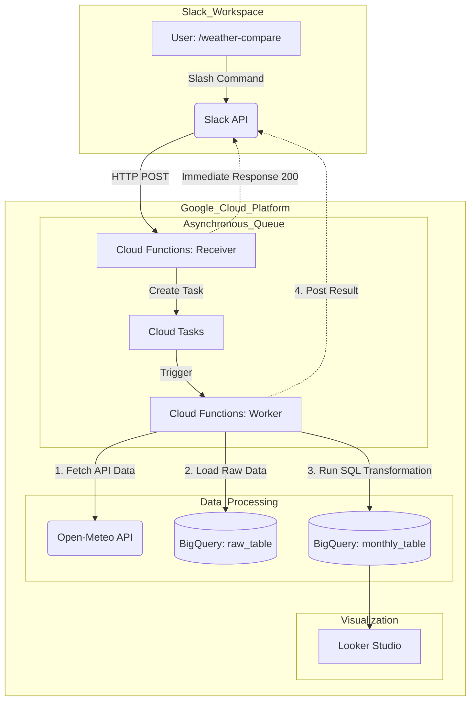

# RetroWeather-Insights: Serverless Data Pipeline

70年前（1950年代）と現代の気象データを比較・分析するためのサーバーレス・データパイプラインです。Slackからのリクエストをトリガーに、GCP上でデータの取得・加工・蓄積を自動で行います。

## 🚀 Overview
「最近の夏は昔より本当に暑いのか？」という疑問を、客観的なデータで検証するために開発しました。
Slackのスラッシュコマンドから特定の地点の気象データを召喚し、BigQueryで集計、Looker Studioで可視化します。

## 🏗 Architecture
Slackの応答制限（3秒）を回避するため、Cloud Tasksを用いた非同期アーキテクチャを採用しています。



### Key Technologies
- **Runtime**: Python 3.11 (Cloud Functions)
- **Infrastructure**: Terraform (IaC)
- **Data Warehouse**: BigQuery
- **Task Queue**: Cloud Tasks (Asynchronous processing)
- **External API**: Open-Meteo Archive API
- **BI Tool**: Looker Studio

## 💡 Technical Highlights & Design Decisions

### 1. Asynchronous Task Handling
Slack APIの3秒タイムアウト制約を解決するため、**Receiver-Workerパターン**を採用。
- `Receiver` 関数: リクエストを即座に受理し、200 OKを返却。
- `Cloud Tasks`: 処理をキューイングし、リトライ耐性を確保。
- `Worker` 関数: 実際のデータフェッチと集計を実行。

### 2. Efficient Data Processing (SQL-First)
データ処理の負荷を考慮し、役割を明確に分離しました。
- **Python**: APIからのデータ抽出（ETLのEとL）を担当。
- **SQL (BigQuery)**: 70年分のデータ計算（不快指数の算出、月次集計）を担当。
これにより、アプリケーション側のメモリ消費を抑え、高速な集計を実現しています。

### 3. Infrastructure as Code (Terraform)
コンソールでの手動設定を一切排除し、すべてのGCPリソースをTerraformで定義。
`terraform apply` 一発で分析基盤が立ち上がる再現性を担保しています。

## 🛠 Usage
1. Slackで `/weather-compare` を実行。
2. Cloud Tasks経由でWorkerが起動し、Open-Meteoから過去と現在のデータを取得。
3. BigQuery上で集計SQLが実行され、`monthly_comp_data` テーブルが更新。
4. 処理完了後、Slackに完了通知が届きます。

## 🚧 Roadmap (Future Improvements)
- [ ] **Security**: Slack Signing Secret を用いたリクエスト署名の検証実装。
- [ ] **Monitoring**: Slack Webhook を利用したエラー通知の高度化。
- [ ] **Data Scope**: 比較対象期間をパラメータで動的に変更できる機能。


## 📁 Project Structure

```text
.
├── terraform/                # Infrastructure as Code (IaC)
│   ├── main.tf               # メインのリソース定義 (Functions, Tasks, BQ)
│   ├── variables.tf          # 環境変数・設定値の定義
│   ├── outputs.tf            # デプロイ後に出力する情報（URL等）
│   └── files/                # デプロイ用にアーカイブされたzip（自動生成）
│
├── functions/                # Cloud Functions ソースコード
│   ├── receiver/             # Slackリクエスト受付用 (Receiver)
│   │   ├── main.py           # 受付ロジック & Cloud Tasksへの登録
│   │   └── requirements.txt  # 依存ライブラリ (google-cloud-tasks等)
│   │
│   └── worker/               # データ取得・加工用 (Worker)
│       ├── main.py           # Open-Meteo API取得 & BQロード
│       ├── requirements.txt  # 依存ライブラリ (pandas, pandas-gbq等)
│       └── sql/              # 集計用SQLクエリ
│           └── create_monthly_comp.sql  # 70年前比較用の集計SQL
│
└── docs/                     # ドキュメント、構成図、スクリーンショット

```

### 解説のアピールポイント（READMEに追加する言葉）

この構造図のすぐ下に、以下のような「設計意図」を数行添えるとさらに効果的です。

> #### **Design Intent**
> - **Separation of Concerns**: インフラ（Terraform）とアプリケーションロジック（functions）を分離し、保守性を高めています。
> - **SQL Externalization**: 複雑な集計ロジックをPythonコード内に直接記述せず、`.sql`ファイルとして外出しすることで、SQL単体でのテストや修正を容易にしています。
> - **Modular Functions**: 受付（Receiver）と実行（Worker）を別関数に分けることで、将来的な「Slack以外のインターフェース追加」にも柔軟に対応できる構成にしています。

---
## 🚀 Setup & Deployment
このプロジェクトを自身のGoogle Cloud環境にデプロイする手順です。
1. 前提条件 (Prerequisites)
Google Cloud Project の作成と課金有効化
Google Cloud CLI (gcloud) のインストール
Terraform (v1.5.0以上推奨) のインストール


2. Google Cloud の認証と準備
ターミナルから自身のプロジェクトに対して認証を行います。

# ログイン
gcloud auth application-default login

# プロジェクトの設定
gcloud config set project [YOUR_PROJECT_ID]

# 必要なAPIの有効化
gcloud services enable \
  cloudfunctions.googleapis.com \
  cloudbuild.googleapis.com \
  cloudtasks.googleapis.com \
  bigquery.googleapis.com \
  artifactregistry.googleapis.com

3. Terraform によるデプロイ
terraform/ ディレクトリに移動し、リソースを作成します。

cd terraform

# 初期化
terraform init

# 実行計画の確認
terraform plan

# デプロイ実行
terraform apply
Note: デプロイが完了すると、slack_receiver_url が出力されます。これをSlackのSlash Command設定に使用します。

4. Slack App の設定
Slack API Control Panel で新しいアプリを作成します。
Slash Commands を作成し、以下を設定します：
Command: /weather-compare
Request URL: Terraformの出力結果にある slack_receiver_url を入力。
アプリをワークスペースにインストールします。


Infrastructure as Code (IaC) の徹底
手動でのコンソール操作を最小限に抑え、すべてのリソース（IAM権限、ネットワーク、データベース、キュー、サーバーレス関数）をコードで管理しています。これにより、環境の「構成ドリフト」を防ぎ、本番環境への移行もスムーズに行える設計になっています。

次のステップとして
これでGitHubのREADMEの主要パーツ（概要・構成・構造・デプロイ）が揃いました！
最後に、「未着手の認証（Signing Secrets）」を今後どう実装する予定か、Slack APIの公式ドキュメントへのリンクを交えつつ、「Roadmap / Future Improvements」の章を詳しく書き上げましょうか？
これにより、「現在の未完成部分」を「将来の伸び代」としてポジティブに表現できます。

