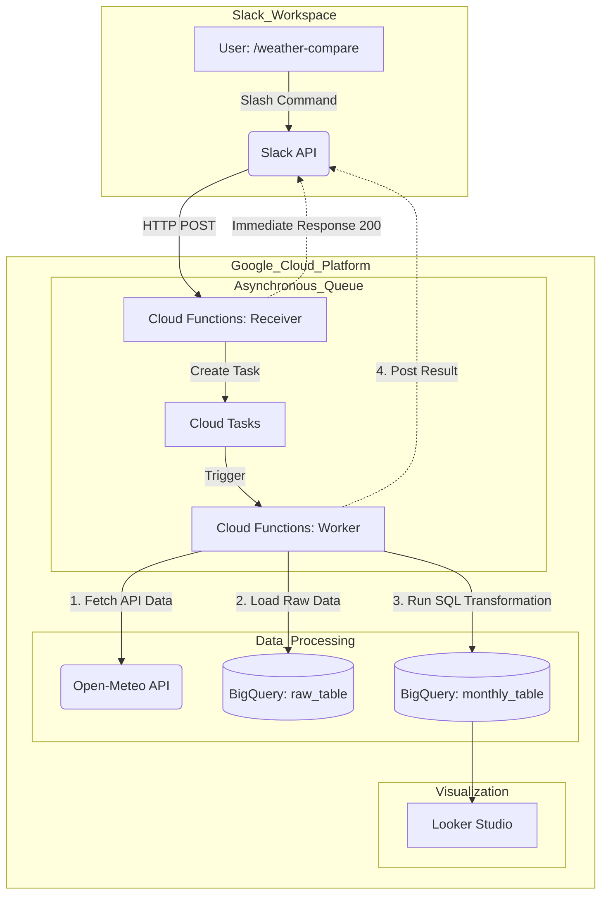

<<<<<<< HEAD
# 1.はじめに
Google Cloud での学びを活かし、最近気になっているトピックについて調査を行いました。
「近年の夏は非常に暑いが、昔はどうだったのか？」という疑問を以前から抱いていたため、この機会に「70年前（1950年代）と現代の気象データには統計的にどれほどの差があるのか」を検証しました。
本プロジェクトでは、Google Cloud を用いたデータパイプラインを構築し、Slack からのオンデマンド実行、Cloud Tasks による非同期処理、Terraform による IaC 管理など、実務を意識した構成で実装しています。
70年前との最高気温の比較結果は、以下の通りです。


| ◆構成 |
|:---------------|
|[1.はじめに](#1はじめに) |
|[2.技術スタックとシステム構成](#2技術スタックとシステム構成)|
|[3.「Cloud Function(slack_receiver)」のソース詳細](#3cloud-functionslack_receiverのソース詳細)|
|[4.「Cloud Function(weather-worker)」のソース詳細](#4cloud-functionweather-workerのソース詳細)|
|[5.デプロイ方法](#5デプロイ方法)|
|[6.Slack API への設定](#6slack-api-への設定)|
|[7.Slack App からの動作確認](#7slack-app-からの動作確認)|
|[8.データ可視化/考察](#8データ可視化考察)|
|[9.まとめ](#9まとめ)|


# 2.技術スタックとシステム構成

## 2-1.技術スタック

本システムでは、以下の技術スタックを採用しています。

### 2-1-1. プラットフォーム (Google Cloud)
以下のサービスを使用しています。


| サービス| 説明 |
| :--- | :--- |
|Cloud Functions|サーバーレス実行環境|
|Cloud Tasks| バックグラウンド処理のスケジューラー |
|BigQuery| サーバーレスなデータ倉庫|
|Secret Manager|機密情報管理サービス |
|IAM|権限管理サービス|


### 2-1-2. インフラ(Infrastructure as Code)
| ツール | 説明 |
| :--- | :--- |
|Terraform|Google Cloud上のリソース/権限設定を、コードで一元管理|


### 2-1-3. 言語 (Python)

| ライブラリ|説明 |
| :--- | :--- |
|Slack Bolt for Python|Slack アプリ開発フレームワーク|
|Pandas| データ分析ライブラリ|
| google-cloud-bigquery| GCP用クライアントライブラリ|

### 2-1-4. API

| API|説明 |
| :--- | :--- |
| Open-Meteo API|歴史的気象データ提供API|
|Slack API|コミュニケーションプラットフォームAPI|


## 2-2. システム構成
システム構成と簡単なフローを図示します。
フロー詳細は、Cloud Function に関する説明で行います。


## 2-3. ディレクトリ構成
インフラ管理（Terraform）コマンドで、デプロイできる構成となっています。

  Terraformに関しては、GitHubレポジトリに詳細説明をしています。
```text
.
├── .gitignore
├── README.md               # 使い方・セットアップ手順
├── functions/              # Pythonコード
│   ├── receiver/
│   │   ├── main.py
|   |   └── requirements.txt # 依存ライブラリ
│   └── worker/
│       ├── main.py
|       ├── requirements.txt # 依存ライブラリ
|       └── sql/              # 集計用SQLクエリ
|            └── create_monthly_comp.sql
|
└── terraform/              # 提供いただいたコード
    ├── main.tf             # リソース定義
    ├── variables.tf        # 変数定義（sensitive設定含む）
    ├── terraform.tfvars.example  # ★ 見本ファイル（後述）
    └── files/

```


# 3.「Cloud Function(slack_receiver)」のソース詳細

## 3-1.機能
Slackからのリクエストを Secret Manager で認証しつつ、Cloud Tasks へジョブを投入。
Slackへは即座に応答を返す役割を担っています。


### 1. <ins>_署名検証_</ins>
届いたリクエストが本物の Slack からであるかを、 Secret Manager　の値を参照して自動チェックする。
届いたリクエストが本物の Slack からであることを、Secret Manager から環境変数に注入された SLACK_SIGNING_SECRET を用いて自動チェックします。


### 2. <ins>_非同期ジョブの登録_</ins>
時間のかかる気象データの取得・集計処理をこの関数内で直接行わず、Google Cloud Tasks のキューにジョブとして登録します。
この際、以下の情報をセットも後続の関数にに渡します。


|情報|内容|
| :--- | :--- |
|command_text|ユーザーが入力したコマンド引数|
|response_url|後でslackに結果を通知するための宛先|


### 3. <ins>_Slack 応答制御 (3秒ルールの回避)_</ins>
Slack サーバーに対し、3秒以内に ack()（即時レスポンス）を返します。ユーザー画面には「受理しました...」と表示され、タイムアウトエラーを防ぎます。
「受付」と「実行（Worker）」を切り離すことで、ユーザーを待たせずにバックグラウンドで重い処理を走らせる構成になっています。


## 3-2.処理フロー
コード内で行われる処理の詳細内容を記載します。
([3-3.コード](#3-3コード)に掲載しているので、そちら参照して下さい)

### 1. <ins>_「エントリーポイント」呼び出しと Bolt への委譲_</ins>

Slack からの通知を受けると、まず `◆機能ブロック3`の`slack_receiver`が呼び出されます。
ここで`return handler.handle(request)`と記述することで、以下の複雑な処理を Slack Bolt フレームワークへ一任しています。

**●署名検証の自動実行:** リクエストが正規の Slack からのものか、`◆機能ブロック1`で設定されたシークレット（Secret Manager 経由）を用いて即座に判定します。

**●ルーティング:** 届いたコマンド`/comp_start`を解析し、`◆機能ブロック4`のハンドラー関数を特定して自動的に実行します。

### 2. <ins>_Slack への即時応答（3秒ルールの回避）_</ins>
`◆機能ブロック4`内では、まず最初に`ack()`を実行します。
Slack API の「3秒以内のレスポンス」という制約をクリアする為、まずは「リクエストを受理しました」という応答を Slack サーバーへ即座に返します。
これにより、ユーザー画面でのタイムアウトエラーを防ぎます。

### 3. <ins>_非同期タスクの登録_</ins>
時間のかかる気象データの集計処理を`Google Cloud Tasks`に登録します。


**●情報のパッキング:** ユーザーの入力内容（text）と、後で結果を報告するための宛先（response_url）を JSON 形式でまとめます。
**●ワーカーへの依頼:** 生成したタスクをキューに投入します。これにより、実際の重い処理は「weather-worker」側の Cloud Functions に引き継がれ、この受付関数（Receiver）自体はリソースを解放して安全に終了します。


## 3-3.コード
Cloud Function(slack_receiver)に登録したコードになります。

```python
import os
import json
from slack_bolt import App
from slack_bolt.adapter.google_cloud_functions import SlackRequestHandler
from google.cloud import tasks_v2

# インスタンスをグローバルに定義し、コールドスタートを高速化
client = tasks_v2.CloudTasksClient()

#######################################
# ◆機能ブロック1:「Bolt アプリの初期化」
#######################################
# 1. Secret Manager から値を取得、環境変数にセット済(Terraform)
# 2. 環境変数から値を読み取り、署名検証(Signing Secret)の準備を行う
app = App(
    token=os.environ.get("SLACK_BOT_TOKEN"),
    signing_secret=os.environ.get("SLACK_SIGNING_SECRET"),
    # Cloud Functions で ack() を先に返すための設定
    process_before_response=True
)

###################################################
# ◆機能ブロック2:「Cloud Functions 用のハンドラー作成」
###################################################
handler = SlackRequestHandler(app)

#######################################
# ◆機能ブロック3:「エントリーポイント」
#######################################
def slack_receiver(request):
    # Bolt にリクエストを丸投げ（ここで署名検証とコマンド実行が行われる）
    return handler.handle(request)


#############################################################
# ◆機能ブロック4:「スラッシュコマンド(/comp_start)のハンドラー」
#############################################################
@app.command("/comp_start")
def handle_weather(ack, body):
    # 1. Slackへ即座に応答を返す（3秒ルール回避）
    ack("リクエストを受理しました。気象データの集計を開始します...")

    # 2. Cloud Tasks への登録準備
    project = os.environ.get("PROJECT_ID")
    location = os.environ.get("LOCATION")
    queue = os.environ.get("QUEUE_ID")
    worker_url = os.environ.get("WORKER_URL")
    
    # 後続の 「fetch_weather_handler」 に必要な情報を取得
    response_url = body.get("response_url")
    command_text = body.get("text", "")

    parent = client.queue_path(project, location, queue)

    # 3. 非同期タスクの生成
    task = {
        'http_request': {
            'http_method': tasks_v2.HttpMethod.POST,
            'url': worker_url,
            'headers': {"Content-type": "application/json"},
            'body': json.dumps({
                "text": command_text,
                "response_url": response_url
            }).encode(),
            'oidc_token': {
                'service_account_email': f"weather-app-sa@{project}.iam.gserviceaccount.com"
            }
        }
    }

    # 4. キューへの投入（バトンタッチ完了）
    try:
        client.create_task(parent=parent, task=task)
    except Exception as e:
        print(f"Error creating task: {e}")


```


# 4.「Cloud Function(weather-worker)」のソース詳細

## 4-1.機能

### 1. <ins>_Cloud Tasks 経由の非同期ジョブ実行_</ins>
Slackの「3秒ルール」を回避し、時間のかかる重い処理（外部API取得やデータ分析）をバックグラウンドで安全に完結させます。

### <ins>_2.Open-Meteo API と BigQuery のデータ連携_</ins>
Open-Meteo API から取得した70年前と現代の気象データを、BigQuery へ高速にロードします。

### <ins>_3.外部SQLによるデータ集計_</ins>
外部SQLファイルを使用して、BigQueryデータ上にある「気温」、「湿度」、「不快指数（DI）」などに対して処理を実施します。

## 4-2.処理フロー
コード内で行われる処理の詳細内容を記載します。
([4-3.コード](#4-3コード)に掲載しているので、そちら参照して下さい)

### 1. <ins>_「エントリーポイント」呼び出しと設定_</ins>
**●リクエストの取得:** Cloud Tasks から渡された response_url を取り出します。Slack へ結果を報告する「返信先アドレス」です。
**●環境変数の取得:** Terraform で注入したプロジェクトIDや座標（LAT/LON）などを読み込みます。数値データはfloat型へ変換します。
**●BigQuery 初期化:** Google Cloud の認証情報を元に、BigQuery 操作用のクライアント・インスタンスを作成します。
**●デフォルトの成功メッセージ:** 処理の最後に送るメッセージの初期値をセットします。


### 2. <ins>_「ETL処理の実行」_</ins>
外部 API からデータを抽出し、BigQuery へ格納する機能を担います。
この関数外で定義されている「fetch_and_load」を呼び出して処理を実行します。
①Open-Meteo API から JSON データを取得
②Pandas を使って BigQuery の DATE 型に合う形式へ整形
③(1952年～1954年),(2023年～2025年)の6年分のデータを順番に WRITE_APPEND(追記)し、1つのテーブルに集約します


### 3. <ins>_「外部SQLによるデータ集計」_</ins>
集計用SQL（create_monthly_comp.sql）では、BigQueryの強力な演算リソースを活用し、以下の4つの処理を実行しています。

#### ●処理1：不快指数（DI）の算出
WITH 句（daily_data）の中で、各日の平均気温と平均湿度から「不快指数」を計算しています。これを1日単位で算出しておくことで、月間平均としての精度を高めています。
#### ●処理2：70年前（1952-1954）の月別統計
IF 文と AVG 関数を組み合わせ、対象期間が1950年代のデータのみを抽出して、月ごとの「平均気温・最高気温・湿度・不快指数」を算出しています。
#### ●処理3：現代（2023-2025）の月別統計
同様のロジックで、直近の気象データについても月別に集計します。同じテーブルにロードされた異なる時代のデータを、SQL上で「列（カラム）」として分離しています。
#### ●処理4：比較用集計テーブルの作成・更新
CREATE OR REPLACE TABLE を使用することで、古い集計結果を破棄し、常に最新の比較データを保持した monthly_comp_data テーブルを再構築します。これにより、後続のグラフ化や分析が容易になります。


```create_monthly_comp.sql
CREATE OR REPLACE TABLE `{PROJECT_ID}.{DATASET_ID}.monthly_comp_data` AS
WITH daily_data AS (
  SELECT
    EXTRACT(MONTH FROM date) AS month,
    EXTRACT(YEAR FROM date) AS year,
    temp_max,
    temp_min,
    (temp_max + temp_min) / 2 AS avg_temp,
    humidity_mean,
    -- 不快指数の計算（1日単位）
    (0.81 * ((temp_max + temp_min) / 2) + 0.01 * humidity_mean * (0.99 * ((temp_max + temp_min) / 2) - 14.3) + 46.3) AS di
  FROM `{PROJECT_ID}.{DATASET_ID}.raw_weather_data`
)
SELECT
  month,
  -- 70年前 (1952-1954) の集計
  ROUND(AVG(IF(year BETWEEN 1952 AND 1954, avg_temp, NULL)), 1) AS avg_temp_70s,
  ROUND(AVG(IF(year BETWEEN 1952 AND 1954, temp_max, NULL)), 1) AS temp_max_70s,
  ROUND(AVG(IF(year BETWEEN 1952 AND 1954, humidity_mean, NULL)), 1) AS humidity_70s,
  ROUND(AVG(IF(year BETWEEN 1952 AND 1954, di, NULL)), 1) AS di_70s,
  
  -- 現代 (2023-2025) の集計
  ROUND(AVG(IF(year BETWEEN 2023 AND 2025, avg_temp, NULL)), 1) AS avg_temp_now,
  ROUND(AVG(IF(year BETWEEN 2023 AND 2025, temp_max, NULL)), 1) AS temp_max_now,
  ROUND(AVG(IF(year BETWEEN 2023 AND 2025, humidity_mean, NULL)), 1) AS humidity_now,
  ROUND(AVG(IF(year BETWEEN 2023 AND 2025, di, NULL)), 1) AS di_now
FROM daily_data
GROUP BY month
ORDER BY month;
```

### 4. <ins>_「Slack への応答メッセージ送信」_</ins>
全ての重い処理が完了したタイミングで、ユーザーへフィードバックを行います。
**非同期フィードバック:** 最初に保持しておいた response_url に対し、集計結果の成否を POST します。
**例外のキャッチ:** エラー発生時には、except ブロックでエラー内容をメッセージに書き換え、Slack へ通知できる仕組みとなっています。

### 5. <ins>_「Cloud Taskへのレスポンス」_</ins>
この処理の「エントリーポイント」呼び出しは、Cloud Tasks からのリクエストだったので、すべての処理が終了した時点で、Cloud Tasks に正常終了のレスポンスを返します。


## 4-3.コード
Cloud Function(weather-worker)に登録したコードになります。

```python
import functions_framework
import pandas as pd
import requests
import os
from google.cloud import bigquery

@functions_framework.http
#######################
# ◆機能ブロック1:「エントリーポイント」
#######################
def fetch_weather_handler(request):
    # 1. リクエストと環境変数の取得
    request_json = request.get_json(silent=True)
    response_url = request_json.get('response_url') if request_json else None
    
    PROJECT_ID = os.environ.get("PROJECT_ID")
    DATASET_ID = os.environ.get("DATASET_ID")
    TABLE_ID   = os.environ.get("TABLE_ID")
    # 環境変数は「文字列」で届くため、数値計算やAPI用に float へキャスト
    LAT        = float(os.environ.get("LAT")) 
    LON        = float(os.environ.get("LON"))
    
    table_path = f"{PROJECT_ID}.{DATASET_ID}.{TABLE_ID}"
    client = bigquery.Client(project=PROJECT_ID)
    
    # デフォルトの成功メッセージ
    message = "✅ 気象データの更新と集計テーブルの作成が完了しました！"

    try:
        # 2. 既存データの消去
        client.query(f"TRUNCATE TABLE `{table_path}`").result()

        #############################################
        # ◆機能ブロック2:「ETL処理の実行」(関数呼出し)
        #############################################
        fetch_and_load("1952-01-01", "1954-12-31", client, table_path, LAT, LON)
        fetch_and_load("2023-01-01", "2025-12-31", client, table_path, LAT, LON)
        
        #########################################
        # ◆機能ブロック3: SQL集計処理
        #########################################
        sql_path = os.path.join(os.path.dirname(__file__), 'sql', 'create_monthly_comp.sql')
        with open(sql_path, 'r', encoding='utf-8') as f:
            sql_template = f.read()
        
        # テンプレート内の変数を置換して実行
        sql = sql_template.format(PROJECT_ID=PROJECT_ID, DATASET_ID=DATASET_ID)
        client.query(sql).result() 
        
    except Exception as e:
        # エラー発生時はメッセージを上書きし、ログに出力
        message = f"❌ 処理中にエラーが発生しました: {str(e)}"
        print(f"Detailed Error: {str(e)}")

    ###################################################
    # ◆機能ブロック4: Slack への応答メッセージ送信
    ###################################################
    if response_url:
        requests.post(response_url, json={
            "text": message,
            "response_type": "in_channel"
        })

    # Cloud Tasks への正常応答
    return "OK", 200 


####################################
# ◆「ETL処理の実行」する関数
####################################
def fetch_and_load(start, end, bq_client, table_path, lat, lon):
    """
    API抽出(Extract) -> 整形(Transform) -> ロード(Load) を担う汎用関数
    """
    url = "https://archive-api.open-meteo.com/v1/archive"
    params = {
        "latitude": lat, 
        "longitude": lon, 
        "start_date": start, 
        "end_date": end,
        "daily": ["temperature_2m_max", "temperature_2m_min", "relative_humidity_2m_mean"],
        "timezone": "Asia/Tokyo"
    }
    
    # API リクエスト
    response = requests.get(url, params=params)
    resp_json = response.json()

    # Pandas によるデータ整形
    df = pd.DataFrame(resp_json["daily"])
    # DATE型へ変換（時刻の切り捨て）
    df['time'] = pd.to_datetime(df['time']).dt.date
    
    # カラム名を BigQuery のスキーマに合わせる
    df = df.rename(columns={
        "time": "date", 
        "temperature_2m_max": "temp_max",
        "temperature_2m_min": "temp_min", 
        "relative_humidity_2m_mean": "humidity_mean"
    })
    
    # BigQuery への追記ロード
    job_config = bigquery.LoadJobConfig(write_disposition="WRITE_APPEND")
    job = bq_client.load_table_from_dataframe(df, table_path, job_config=job_config)
    job.result()

```

# 5.デプロイ方法

## 5-1. 事前準備
Terraform実行前に以下のAPIを有効にする必要があります。
|サービス名 |説明|
| :--- | :--- |
|Cloud Functions|サーバーレス関数のデプロイ・実行に必要|
|Cloud Build|関数のデプロイ時、ソースをビルドするために内部で使用|
|Cloud Tasks|非同期キュー（待ち行列）の作成・管理に必要|
|BigQuery|データセットやテーブルの作成、クエリ実行に必要|
|Secret Manager|Slackトークン等の機密情報の保管・参照に必要|
|Artifact Registry|関数のイメージ保存先として必要|
|Cloud Storage|ソースコードZIPの保存用|
|Cloud Resource Manager|IAM（権限）の設定を自動化する場合に必要|


## 5-2. デプロイ
コマンドによるデプロイの実行。
```bash
# 1. ディレクトリ「./terraform」に移動する
cd ./terraform

# 2. 変数定義ファイルの作成・編集
cp terraform.tfvars.example terraform.tfvars

# 3. ブラウザが起動するので、Googleアカウントでログイン
gcloud auth application-default login

# 4. terraform(初期化)
terraform init

# 5. 計画確認
terraform plan

# 6. 実行（リソースの作成・変更）
terraform apply

# 7. リソースの削除
terraform destroy
```


# 6.Slack API への設定 
「Google Cloud」での設定は完了したので、「Slack API」に設定を反映させると連携できます。

## 6-1. STEP 1：接続先URL（エンドポイント）の設定
「Google Cloud」の「受付窓口」にあたるURLを取得します。
それは作成された slack-receiver の「トリガー」 タブにある 「URL」に該当します。

## 6-2. STEP 2：Slack API 管理画面からURL登録
以下のメニュー選択から設定を行います。
① 左メニューの「Slash Commands」をクリック。
②/comp_start の編集ボタン（鉛筆アイコン）をクリック。
　先ほどの URL を以下の赤枠内に貼り付けて、「Save」を実行。


# 7.Slack App からの動作確認
Slack からスラッシュコマンドで実行して、正常動作すると画面表示は以下の様になります。

### 1. <ins>_Slack へのスラッシュコマンド入力_</ins>
下図のように、スラッシュコマンド`/comp_start`を入力し、実行を押します。


### 2. <ins>_Slack への応答_</ins>
以下の2回の応答が返ってくると正常に処理が終了した事になります。

**最初の応答:** 「リクエストを受理しました。気象データの集計を開始します...」とGCP側から応答が返ってきます、これはスラッシュコマンド実行から3秒以内に返ってきます。

**2回目の応答:** GCP側で全ての処理が完了後に、「 ✅気象データの更新と集計テーブルの作成が完了しました！」とメッセージが返ってきます。


# 8.データ可視化/考察

GCP側では最終的に、以下の様なテーブルデータが作成されるので、これを元に Looker Studio による可視化を実施しました。


1950年代（青）と現在（オレンジ）を比較すると、年間を通して`気温`,`不快指数`は底上げされていることが一目でわかります。


### 📊 結論：「東京の不快な夏」

最高気温と不快指数のデータを統合して分析した結果、以下のことが分かり、「生活のしづらさ」が明確に現れる結果となりました。

- **暑さの長期化:** 7月～9月の最高気温は平均30℃を超え、70年前の8月よりも高く、暑い夏が長期化している実態が浮き彫りになりました。
- **湿度の低下:** 湿度に関しては、どの月でも低下傾向にあるのは意外でしたが、都市化などが関係している様です。
- **不快指数の突破:** 1950年代（青）は「不快ライン(80)」に届く月がありませんでしたが、現在は7月・8月と2ヶ月連続でラインを超えています。(湿度低下の影響はあまりない)


# 9.まとめ
今回は実務で活用されやすいと想定される技術を組合わせました。
**Terraform:** インフラのコード管理（IaC）
**SQL:** BigQueryでのデータ集計・分析
**Slack API:** Boltフレームワークによる非同期インターフェース

:::note info
BigQueryのデータ処理はシンプルに留めましたが、GCPリソース間の認証、連携、制御など、実際にやってみて気づく点が多々あり「システム構築の難しさ」を実感できたのは有意義でした。
今後はデータの可視化についても学習を深め、より実用的で視覚的なアウトプットができる技術も身に着けたいと思っています。
:::


# 10.Terraform
初めての Terraform 使用ということもあり、AIを参考にしながらの作成となりました。

## 10-1. Terraform とは
HCL（HashiCorp Configuration Language）という専用の言語で記述して、GCPのインフラを構築してくれるツールです。GCPだけではなく、AWS、Azureなど主要なクラウドプラットフォームでも使用できます。
Terraformでは、主に`resource`ブロックを使って各リソースを列挙し、構成を指定します。
最大の特徴は、人間が「作る順番」を指示しなくても、Terraformが **リソース間の依存関係を自動で解析し、最適な順番で構築・更新してくれる点** にあります。
また、`「State」`と呼ばれるファイルで現在のインフラの状態を記憶しているため、コードを変更して再実行するだけで、 **必要な差分だけを自動で適用してくれる仕組み（宣言型）** になっています。


## 10-2. 使用方法
バイナリツールをインストールすることで使用でき、provider 宣言で指定したプラットフォーム（今回はGoogle Cloud）に対応したAPIを呼び出してくれます。
主に以下の3種類のブロックで構成し、インフラリソースを定義しています。
**resource (リソース):** GCP上に「実物（関数、テーブルなど）」を作成・管理するためのブロック。
**variable (入力変数):** プロジェクトIDなどを外部から注入するための設定。プログラムの「引数」のような役割です。
**data (データソース):** 既存のリソース情報やローカルファイルの内容を参照（読み込み）するためのブロック。


```hcl
resource "種類" "名前" {
  設定項目 = 値
}
```


## 10-3. スクリプト解説


### 1. <ins>_プロジェクト初期設定_</ins>

```terraform
# ---------------------------------------------
# Google Cloud プロバイダの設定
# 操作対象のプロジェクトとデフォルトのリージョンを指定します
# ---------------------------------------------
provider "google" {
  project = var.project_id
  region  = var.region
}

# ---------------------------------------------
# Cloud Functions 用のソースコード格納バケット
# 関数をデプロイするための ZIP ファイルを保持します
# ---------------------------------------------
resource "google_storage_bucket" "source_bucket" {
  name     = "${var.project_id}-functions-source"
  location = "ASIA-NORTHEAST1"
}

# ---------------------------------------------
# Cloud Tasks キューの作成
# ---------------------------------------------
resource "google_cloud_tasks_queue" "default" {
  name     = var.queue_id
  location = var.region
}
```
### 2. <ins>_Pythonスクリプト(1)のアップロード_</ins>

「./functions/receiver/main.py」をZIP化してアップロード。
`main.py`内データを全て読み取って違いがあればアップデートする仕組みとなっています。

```terraform
# ---------------------------------------------------------
# 1. ローカルのPythonソースをZIP圧縮
# ---------------------------------------------------------
data "archive_file" "receiver_zip" {
  type        = "zip"
  source_dir  = "${path.module}/../functions/receiver"
  output_path = "${path.module}/files/receiver.zip"
}

# ---------------------------------------------------------
# 2. 圧縮したファイルをCloud Storageへアップロード
# ---------------------------------------------------------
resource "google_storage_bucket_object" "receiver_archive" {
  name   = "receiver-${data.archive_file.receiver_zip.output_md5}.zip"
  bucket = google_storage_bucket.source_bucket.name
  source = data.archive_file.receiver_zip.output_path
}

```
### 3. <ins>_Cloud Function(1)の定義_</ins>
slackからのリクエストを受付ける`Cloud Function(第一世代)`に対して詳細定義をしています。

```terraform
# ---------------------------------------------------------
# 3. Cloud Function(第一世代)の定義
# ---------------------------------------------------------
resource "google_cloudfunctions_function" "receiver" {
  # 基本設定（名前と言語）
  name        = "slack-receiver"
  runtime     = "python311"
  entry_point = "slack_receiver"
  
  # ソースコードの場所(先ほどアップロードした ZIPファイルをソースとして使用する)
  source_archive_bucket = google_storage_bucket.source_bucket.name
  source_archive_object = google_storage_bucket_object.receiver_archive.name
  # 公開設定(この関数に URL を発行し、インターネット（Slack）からアクセスできる)
  trigger_http          = true

  # 環境変数の作成(Python受け渡し用)
  environment_variables = {
    PROJECT_ID = var.project_id
    QUEUE_ID   = var.queue_id
    LOCATION   = var.region
    WORKER_URL = google_cloudfunctions_function.worker.https_trigger_url
  }

  # シークレットのマッピング
  secret_environment_variables {
    key     = "SLACK_BOT_TOKEN"
    secret  = "SLACK_BOT_TOKEN"
    version = "latest"
  }
  secret_environment_variables {
    key     = "SLACK_SIGNING_SECRET"
    secret  = "SLACK_SIGNING_SECRET"
    version = "latest"
  }
  # Cloud Tasks への タスク作成許可("google_project_iam_member"で使用)
  service_account_email = google_service_account.functions_sa.email
}
```


### 4. <ins>_Cloud Function(1)のアクセス許可設定_</ins>
`slack-receiver`関数に対して **「インターネット上の誰でも（認証なしで）実行できるようにする」** 設定です。
Slackからの通知を受けるには、Google Cloudの外部からのアクセスを許可する必要があります。
**この関数のみに設定を限定した上で、** Pythonコード側で署名検証することで不正アクセスを除外しています。

```terraform
# ---------------------------------------------------------
#  Cloud Function に対するアクセス許可設定
# ---------------------------------------------------------
resource "google_cloudfunctions_function_iam_member" "receiver_invoker" {
  project        = google_cloudfunctions_function.receiver.project
  region         = google_cloudfunctions_function.receiver.region
  cloud_function = google_cloudfunctions_function.receiver.name
  role           = "roles/cloudfunctions.invoker"
  member         = "allUsers"
}
```

### 5. <ins>_Pythonスクリプト(2)のアップロード_</ins>

「./functions/worker/main.py」をZIP化してアップロード。
「./functions/receiver/main.py」と全く同じ仕組みとなっています。

```terraform
# ---------------------------------------------------------
# 1. ローカルのPythonソースをZIP圧縮
# ---------------------------------------------------------
data "archive_file" "worker_zip" {
  type        = "zip"
  source_dir  = "${path.module}/../functions/worker"
  output_path = "${path.module}/files/worker.zip"
}

# ---------------------------------------------------------
# 2. 圧縮したファイルをCloud Storageへアップロード
# ---------------------------------------------------------
resource "google_storage_bucket_object" "worker_archive" {
  name   = "worker-${data.archive_file.worker_zip.output_md5}.zip"
  bucket = google_storage_bucket.source_bucket.name
  source = data.archive_file.worker_zip.output_path
}

```
### 6. <ins>_Cloud Function(2)の定義_</ins>
Cloud Tasks からのリクエストを受けて処理を実行する`Cloud Function(第一世代)`に対する詳細定義をしています。

```terraform
# ---------------------------------------------------------
# 3. Cloud Function(第一世代)の定義
# ---------------------------------------------------------
resource "google_cloudfunctions_function" "worker" {
  # 基本設定（名前と言語）
  name    = "weather-worker"
  runtime = "python311"
  entry_point = "fetch_weather_handler"

  # BigQuery処理も考慮し、メモリサイズ拡張(256MByte→1024MByte)
  available_memory_mb = 1024
  # タイムアウト延長(1分→5分)
  timeout             = 300

  # ソースコードの場所(先ほどアップロードした ZIPファイルをソースとして使用する)
  source_archive_bucket = google_storage_bucket.source_bucket.name
  source_archive_object = google_storage_bucket_object.worker_archive.name
  # 「この関数に外部や他のサービスからアクセスするための『窓口』を作る」という設定
  # 今回は「Cloud Tasks」から受けるのに必要
  trigger_http          = true

  # 環境変数の作成(Python受け渡し用)
  environment_variables = {
    PROJECT_ID = var.project_id
    DATASET_ID = google_bigquery_dataset.weather_dataset.dataset_id
    LAT        = var.lat
    LON        = var.lon
    TABLE_ID   = var.table_id
  }
  # 実行サービスアカウント設定 ：この関数に「BigQuery操作」などの専用権限を持たせる
  service_account_email = google_service_account.functions_sa.email

}
```

### 7. <ins>_BigQueryデータの設定_</ins>

```terraform
# データ格納場所（データセット）の定義
resource "google_bigquery_dataset" "weather_dataset" {
  dataset_id                 = "weather_data"
  location                   = var.region
  delete_contents_on_destroy = true
}

# 格納するデータの定義
rresource "google_bigquery_table" "weather_table" {
  # 基本設定
  dataset_id          = google_bigquery_dataset.weather_dataset.dataset_id
  table_id            = var.table_id
  deletion_protection = false
  
  # BigQueryのデータフォーマット定義
  schema = <<EOF
[
  {"name": "date",          "type": "DATE", "mode": "REQUIRED"},
  {"name": "temp_max",      "type": "FLOAT", "mode": "NULLABLE"},
  {"name": "temp_min",      "type": "FLOAT", "mode": "NULLABLE"},
  {"name": "humidity_mean", "type": "FLOAT", "mode": "NULLABLE"}
]
EOF
}

```

### 8. <ins>_Secret Manager_</ins>
**◆ Secret Manager の作成と定義**
`for_each`を使用して、2種類の秘密情報を格納する「器」を作成しています。
・`SLACK_BOT_TOKEN`
・`SLACK_SIGNING_SECRET`

```terraform
# ---------------------------------------------------------
# Secret Manager の作成、定義
# ---------------------------------------------------------
resource "google_secret_manager_secret" "slack_secrets" {
  for_each  = toset(["SLACK_BOT_TOKEN", "SLACK_SIGNING_SECRET"])
  secret_id = each.key
  # Googleにお任せで、いつでもどこでも安全に秘密情報を読み取れる状態にする
  replication {
    auto {}
  }
}

```

**◆ Secret Manager に対する権限（IAM）の設定**
作成したシークレットに対して、特定のサービスアカウントのみがアクセスできるよう権限を絞り込んでいます。

```terraform
# ---------------------------------------------------------
# Secret Manager に対する権限の設定
# ---------------------------------------------------------
resource "google_secret_manager_secret_iam_member" "secret_access" {
  for_each  = google_secret_manager_secret.slack_secrets
  secret_id = each.value.id
  # 「シークレットの中身」を取得するための最小限の権限
  role      = "roles/secretmanager.secretAccessor"
  # Cloud Functions を実行する専用サービスアカウントにのみ権限を付与
  member    = "serviceAccount:${google_service_account.functions_sa.email}"
}
```
**◆ シークレット値の割り当て**
Secret Managerで定義した秘密情報に対し、具体的な値を割り当てます。
※本サンプルでは構築の簡便さを優先し`terraform.tfvars`から値を設定しています。
　セキュリティ向上には、コンソール等から手動で直接、設定する事が推奨されます。

```terraform
# ---------------------------------------------------------
# 秘密情報の割り当て(SLACK_BOT_TOKEN)
# ---------------------------------------------------------
resource "google_secret_manager_secret_version" "slack_bot_token_val" {
  secret      = google_secret_manager_secret.slack_secrets["SLACK_BOT_TOKEN"].id
  secret_data = var.slack_bot_token
}

# ---------------------------------------------------------
# 秘密情報の割り当て(SLACK_SIGNING_SECRET)
# ---------------------------------------------------------
resource "google_secret_manager_secret_version" "slack_signing_secret_val" {
  secret      = google_secret_manager_secret.slack_secrets["SLACK_SIGNING_SECRET"].id
  secret_data = var.slack_signing_secret
}
```


### ９. <ins>_Service Account関連_</ins>
**◆ Service Account の作成**
デフォルトのサービスアカウントを使用せず、このアプリ専用のSAを作成して
セキュリティ（最小権限）を確保します。


```terraform
# ---------------------------------------------------------
# 関数実行用の専用サービスアカウントの作成
# ---------------------------------------------------------
resource "google_service_account" "functions_sa" {
  account_id   = "weather-app-sa"
  display_name = "Cloud Functions Execution Service Account"
}
```

**◆外部リソース(Cloud Tasks, BigQuery)に対して、権限（ロール）の付与**

```terraform
# 1. Cloud Tasks へのタスク追加権限（Receiver関数が使用）
resource "google_project_iam_member" "cloud_tasks_enqueuer" {
  project = var.project_id
  role    = "roles/cloudtasks.enqueuer"
  member  = "serviceAccount:${google_service_account.functions_sa.email}"
}

# 2. BigQuery データへの書き込み権限（Worker関数が使用）
resource "google_project_iam_member" "bq_editor" {
  project = var.project_id
  role    = "roles/bigquery.dataEditor"
  member  = "serviceAccount:${google_service_account.functions_sa.email}"
}

# 3. BigQuery の実行権限（Worker関数が使用）
resource "google_project_iam_member" "bq_job_user" {
  project = var.project_id
  role    = "roles/bigquery.jobUser"
  member  = "serviceAccount:${google_service_account.functions_sa.email}"
}
```


**◆ 関数の呼び出し権限の設定**
```terraform
# Worker関数を「作成した専用SA」からのみ呼び出せるよう制限し、未認証の外部アクセスを遮断します
resource "google_cloudfunctions_function_iam_member" "worker_invoker" {
  project        = google_cloudfunctions_function.worker.project
  region         = google_cloudfunctions_function.worker.region
  cloud_function = google_cloudfunctions_function.worker.name
  role           = "roles/cloudfunctions.invoker"
  # 作成した専用SAからの呼び出しのみ許可
  member = "serviceAccount:${google_service_account.functions_sa.email}"
}

# Cloud TasksがSAになり代わって、Workerを叩くために必要な権限です。
resource "google_service_account_iam_member" "sa_user_binding" {
  service_account_id = google_service_account.functions_sa.name
  role               = "roles/iam.serviceAccountUser"
  member             = "serviceAccount:${google_service_account.functions_sa.email}"
}

```
=======
# RetroWeather-Insights: Serverless Data Pipeline

70年前（1950年代）と現代の気象データを比較・分析するためのサーバーレス・データパイプラインです。Slackからのリクエストをトリガーに、GCP上でデータの取得・加工・蓄積を自動で行います。

## 🚀 Overview
「最近の夏は昔より本当に暑いのか？」という疑問を、客観的なデータで検証するために開発しました。
Slackのスラッシュコマンドから特定の地点の気象データを召喚し、BigQueryで集計、Looker Studioで可視化します。

## 🏗 Architecture
Slackの応答制限（3秒）を回避するため、Cloud Tasksを用いた非同期アーキテクチャを採用しています。



### Key Technologies
- **Runtime**: Python 3.11 (Cloud Functions)
- **Infrastructure**: Terraform (IaC)
- **Data Warehouse**: BigQuery
- **Task Queue**: Cloud Tasks (Asynchronous processing)
- **External API**: Open-Meteo Archive API
- **BI Tool**: Looker Studio

## 💡 Technical Highlights & Design Decisions

### 1. Asynchronous Task Handling
Slack APIの3秒タイムアウト制約を解決するため、**Receiver-Workerパターン**を採用。
- `Receiver` 関数: リクエストを即座に受理し、200 OKを返却。
- `Cloud Tasks`: 処理をキューイングし、リトライ耐性を確保。
- `Worker` 関数: 実際のデータフェッチと集計を実行。

### 2. Efficient Data Processing (SQL-First)
データ処理の負荷を考慮し、役割を明確に分離しました。
- **Python**: APIからのデータ抽出（ETLのEとL）を担当。
- **SQL (BigQuery)**: 70年分のデータ計算（不快指数の算出、月次集計）を担当。
これにより、アプリケーション側のメモリ消費を抑え、高速な集計を実現しています。

### 3. Infrastructure as Code (Terraform)
コンソールでの手動設定を一切排除し、すべてのGCPリソースをTerraformで定義。
`terraform apply` 一発で分析基盤が立ち上がる再現性を担保しています。

## 🛠 Usage
1. Slackで `/weather-compare` を実行。
2. Cloud Tasks経由でWorkerが起動し、Open-Meteoから過去と現在のデータを取得。
3. BigQuery上で集計SQLが実行され、`monthly_comp_data` テーブルが更新。
4. 処理完了後、Slackに完了通知が届きます。

## 🚧 Roadmap (Future Improvements)
- [ ] **Security**: Slack Signing Secret を用いたリクエスト署名の検証実装。
- [ ] **Monitoring**: Slack Webhook を利用したエラー通知の高度化。
- [ ] **Data Scope**: 比較対象期間をパラメータで動的に変更できる機能。


## 📁 Project Structure

```text
.
├── terraform/                # Infrastructure as Code (IaC)
│   ├── main.tf               # メインのリソース定義 (Functions, Tasks, BQ)
│   ├── variables.tf          # 環境変数・設定値の定義
│   ├── outputs.tf            # デプロイ後に出力する情報（URL等）
│   └── files/                # デプロイ用にアーカイブされたzip（自動生成）
│
├── functions/                # Cloud Functions ソースコード
│   ├── receiver/             # Slackリクエスト受付用 (Receiver)
│   │   ├── main.py           # 受付ロジック & Cloud Tasksへの登録
│   │   └── requirements.txt  # 依存ライブラリ (google-cloud-tasks等)
│   │
│   └── worker/               # データ取得・加工用 (Worker)
│       ├── main.py           # Open-Meteo API取得 & BQロード
│       ├── requirements.txt  # 依存ライブラリ (pandas, pandas-gbq等)
│       └── sql/              # 集計用SQLクエリ
│           └── create_monthly_comp.sql  # 70年前比較用の集計SQL
│
└── docs/                     # ドキュメント、構成図、スクリーンショット

```

### 解説のアピールポイント（READMEに追加する言葉）

この構造図のすぐ下に、以下のような「設計意図」を数行添えるとさらに効果的です。

> #### **Design Intent**
> - **Separation of Concerns**: インフラ（Terraform）とアプリケーションロジック（functions）を分離し、保守性を高めています。
> - **SQL Externalization**: 複雑な集計ロジックをPythonコード内に直接記述せず、`.sql`ファイルとして外出しすることで、SQL単体でのテストや修正を容易にしています。
> - **Modular Functions**: 受付（Receiver）と実行（Worker）を別関数に分けることで、将来的な「Slack以外のインターフェース追加」にも柔軟に対応できる構成にしています。

---
## 🚀 Setup & Deployment
このプロジェクトを自身のGoogle Cloud環境にデプロイする手順です。
1. 前提条件 (Prerequisites)
Google Cloud Project の作成と課金有効化
Google Cloud CLI (gcloud) のインストール
Terraform (v1.5.0以上推奨) のインストール


2. Google Cloud の認証と準備
ターミナルから自身のプロジェクトに対して認証を行います。

# ログイン
gcloud auth application-default login

# プロジェクトの設定
gcloud config set project [YOUR_PROJECT_ID]

# 必要なAPIの有効化
gcloud services enable \
  cloudfunctions.googleapis.com \
  cloudbuild.googleapis.com \
  cloudtasks.googleapis.com \
  bigquery.googleapis.com \
  artifactregistry.googleapis.com

3. Terraform によるデプロイ
terraform/ ディレクトリに移動し、リソースを作成します。

cd terraform

# 初期化
terraform init

# 実行計画の確認
terraform plan

# デプロイ実行
terraform apply
Note: デプロイが完了すると、slack_receiver_url が出力されます。これをSlackのSlash Command設定に使用します。

4. Slack App の設定
Slack API Control Panel で新しいアプリを作成します。
Slash Commands を作成し、以下を設定します：
Command: /weather-compare
Request URL: Terraformの出力結果にある slack_receiver_url を入力。
アプリをワークスペースにインストールします。


Infrastructure as Code (IaC) の徹底
手動でのコンソール操作を最小限に抑え、すべてのリソース（IAM権限、ネットワーク、データベース、キュー、サーバーレス関数）をコードで管理しています。これにより、環境の「構成ドリフト」を防ぎ、本番環境への移行もスムーズに行える設計になっています。

次のステップとして
これでGitHubのREADMEの主要パーツ（概要・構成・構造・デプロイ）が揃いました！
最後に、「未着手の認証（Signing Secrets）」を今後どう実装する予定か、Slack APIの公式ドキュメントへのリンクを交えつつ、「Roadmap / Future Improvements」の章を詳しく書き上げましょうか？
これにより、「現在の未完成部分」を「将来の伸び代」としてポジティブに表現できます。
>>>>>>> 85b313157fa27a76467fac1807d7270159dc5296

